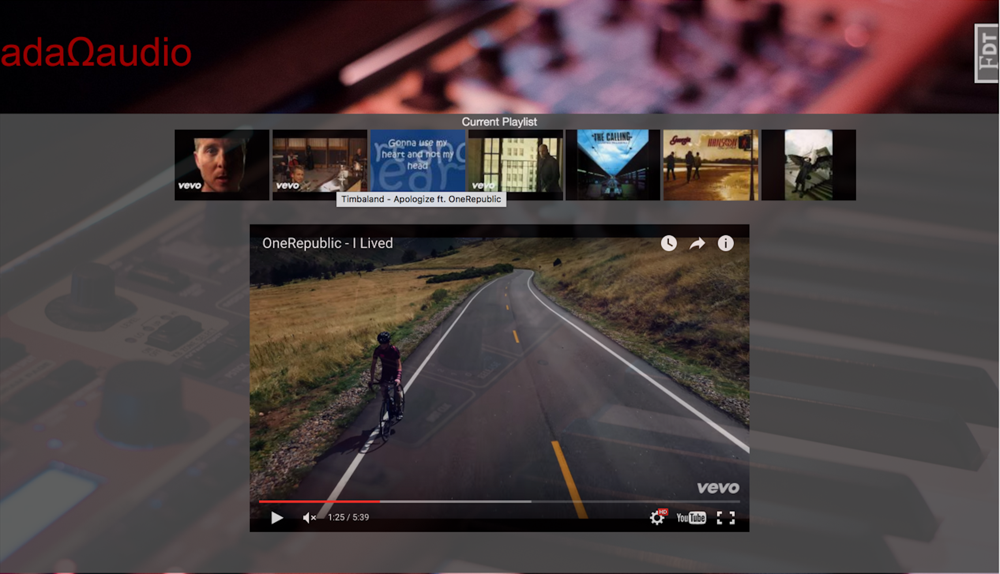

# adaΩaudio

Learn more about the developer: www.linkedin.com/in/kparke/

adaΩaudio is a fullstack music media application that facilitates discovery of new music. Users can enter their favorite song, artist, or music genre, and Ada will generate a customized music video playlist. The user input seeds a text-based playlist which is converted to a music video playlist. Ada automatically displays the music videos to the user and plays through the playlist. Every time a song or genre is entered, adaΩaudio generates a new playlist to increase the chances of new music discovery.

### Homepage
Enter the information for one of the playlists and press submit.

### Playlist Page
The video playlist will automatically start playing. Hover the mouse over the thumbnails to see the song title and artists in the playlist. Right click on the video and select 'loop' to repeat a single song.

### Technologies:
Python, Flask, JavaScript,SQLAlchemy, EchoNest API, jQuery, PostgreSQL, Bootstrap, Jinja, YouTube API, OAuth

### Version 2.0
##### Playlist Scrolling
Skip to your favorite song or remove the songs you dislike before you listen to them. Playlist scrolling will give you the ability to listen to what you want, when you want.
##### Likes and Dislikes
Like or dislike songs to further customized your playlist to your musical tastes.
##### Genre Charts
If someone asked you what your favorite type of music is, would you have an answer? Ada 2.0 will show you a chart of your favorite and least favorite genres based on the songs that are liked and disliked.

### Installation
To run Ada on your own machine, 

$ git clone <insert https-url of project>  
$ cd HB13-Project-Ada-Audio  
$ virtualenv env  
$ source env/bin/activate  
$ source secrets.sh  
$ pip install -r requirements.txt  
$ python server.py  

Runs on localhost:5000